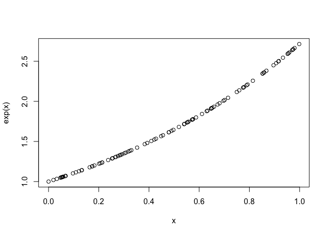

R Demo
================
Pete Mohanty
September 28, 2018

R as calculator
===============

``` r
exp(1)
```

    ## [1] 2.718282

``` r
exp(2)
```

    ## [1] 7.389056

``` r
exp(1)*exp(2)
```

    ## [1] 20.08554

``` r
for(i in 1:10){
  print(i^2)
}
```

    ## [1] 1
    ## [1] 4
    ## [1] 9
    ## [1] 16
    ## [1] 25
    ## [1] 36
    ## [1] 49
    ## [1] 64
    ## [1] 81
    ## [1] 100

``` r
for(i in seq(1, 10, 2)){
  print(i^2)
}
```

    ## [1] 1
    ## [1] 9
    ## [1] 25
    ## [1] 49
    ## [1] 81

``` r
for(i in seq(2, 10, 2)){
  print(i^2)
}
```

    ## [1] 4
    ## [1] 16
    ## [1] 36
    ## [1] 64
    ## [1] 100

``` r
x <- runif(100, 0, 1) # as in 'random uniform' between 0 and 1
y <- runif(100)       # between 0 and 1 actually the default...
plot(x,y)
```



Printing...
===========

When knitting to `PDF`, a bit of care is needed to stay in the margins. `strwrap()` (as in 'string wrap') is handy.

``` r
hacked <- "NEW YORK (AP) — Facebook reported a major security breach in which 50 million user accounts were accessed by unknown attackers. The stolen data allowed the attackers to 'seize control' of those user accounts, Facebook said. Facebook has logged out the 50 million breached users — plus another 40 million who were vulnerable to the attack. Users don’t need to change their Facebook passwords, it said. Facebook says it doesn’t know who is behind the attacks or where they’re based. In a call with reporters on Friday, CEO Mark Zuckerberg said that the company doesn’t know yet if any of the accounts that were hacked were misused."
```

And if you don't want line numbers, use `cat()` (as in `concatenate`).

``` r
strwrap(hacked, 90)    # 90 characters per line
```

    ## [1] "NEW YORK (AP) — Facebook reported a major security breach in which 50 million user"       
    ## [2] "accounts were accessed by unknown attackers. The stolen data allowed the attackers to"    
    ## [3] "'seize control' of those user accounts, Facebook said. Facebook has logged out the 50"    
    ## [4] "million breached users — plus another 40 million who were vulnerable to the attack. Users"
    ## [5] "don’t need to change their Facebook passwords, it said. Facebook says it doesn’t know who"
    ## [6] "is behind the attacks or where they’re based. In a call with reporters on Friday, CEO"    
    ## [7] "Mark Zuckerberg said that the company doesn’t know yet if any of the accounts that were"  
    ## [8] "hacked were misused."

``` r
cat(strwrap(hacked, 90), sep = "\n")  # '\n' means 'new line'
```

    ## NEW YORK (AP) — Facebook reported a major security breach in which 50 million user
    ## accounts were accessed by unknown attackers. The stolen data allowed the attackers to
    ## 'seize control' of those user accounts, Facebook said. Facebook has logged out the 50
    ## million breached users — plus another 40 million who were vulnerable to the attack. Users
    ## don’t need to change their Facebook passwords, it said. Facebook says it doesn’t know who
    ## is behind the attacks or where they’re based. In a call with reporters on Friday, CEO
    ## Mark Zuckerberg said that the company doesn’t know yet if any of the accounts that were
    ## hacked were misused.

Text Vectors
============

``` r
letters
```

    ##  [1] "a" "b" "c" "d" "e" "f" "g" "h" "i" "j" "k" "l" "m" "n" "o" "p" "q"
    ## [18] "r" "s" "t" "u" "v" "w" "x" "y" "z"

``` r
match("t", letters)
```

    ## [1] 20

``` r
LETTERS
```

    ##  [1] "A" "B" "C" "D" "E" "F" "G" "H" "I" "J" "K" "L" "M" "N" "O" "P" "Q"
    ## [18] "R" "S" "T" "U" "V" "W" "X" "Y" "Z"

``` r
match("q", LETTERS)
```

    ## [1] NA

``` r
match("Q", LETTERS)
```

    ## [1] 17

``` r
"Q" %in% LETTERS
```

    ## [1] TRUE

``` r
"Q" %in% letters
```

    ## [1] FALSE

``` r
"Q" %in% c(letters, LETTERS)
```

    ## [1] TRUE

``` r
tolower(LETTERS) == letters
```

    ##  [1] TRUE TRUE TRUE TRUE TRUE TRUE TRUE TRUE TRUE TRUE TRUE TRUE TRUE TRUE
    ## [15] TRUE TRUE TRUE TRUE TRUE TRUE TRUE TRUE TRUE TRUE TRUE TRUE

``` r
LETTERS == toupper(letters)
```

    ##  [1] TRUE TRUE TRUE TRUE TRUE TRUE TRUE TRUE TRUE TRUE TRUE TRUE TRUE TRUE
    ## [15] TRUE TRUE TRUE TRUE TRUE TRUE TRUE TRUE TRUE TRUE TRUE TRUE

``` r
letters[3]
```

    ## [1] "c"

``` r
letters[c(8,9)]
```

    ## [1] "h" "i"

``` r
ROT13 <- c(letters[14:26], letters[1:13]) # Caesar shift of 13
match("b", ROT13)
```

    ## [1] 15

``` r
LETTERS[match("b", ROT13)] # encrypted
```

    ## [1] "O"

``` r
LETTERS[match("o", ROT13)] # and symmetric
```

    ## [1] "B"

``` r
cipher.message <- LETTERS[match(c("h", "e", "l", "l", "o", "w", "o", "r", "l", "d"),
                                ROT13)]
LETTERS[match(tolower(cipher.message), ROT13)]
```

    ##  [1] "H" "E" "L" "L" "O" "W" "O" "R" "L" "D"

Exercise
========

``` r
cipher.txt <- "SQKLE SAXLE ZVKUI BASTE MKLUT SQKZE BMKVS KZKUS BXLAU VOTEM KLUTA LSQKF XBZYA VILYK BSEGA LMEWE RXBBK XBMEL AJESA XLWKB MALMA SVXCC KLVAN KELYY KCKLV ANKXB MELAJ ESAXL VALSQ KQXOK XCWEG ALMSQ KWWXB KEYKO SESCE UALMS QKYAM ASEZS QBKES VXCSQ KNANAVS UKLSI BTEUU XBYAL MSXUI BBKLS ELYCX BWKBX CCAUA EZVAL OZEUK XCSQK VAMLE ZVALS KZZAM KLUKE LYALC XBWES AXLEV VIBEL UKYAB KUSXB ESKVS QKXBM ELAJE SAXLV SQESQ AVSXB AUEZZ TQENK VOAKY XLCXB KAMLS EBMKS VELYY KCKLY KYUZE VVACA KYLKS FXBGV EMEAL VSVOT ALMBK VOKUS ANKZT SQKLV EAVUB KESAL MEYAB KUSXB ESKXC XOKBE SAXLV SQESU XWDAL KVSQK XOKBE SAXLE ZKZKW KLSVX CKEUQ SQAVS BEYAS AXLEZ EOOBX EUQFK QENKF QKBKF KUBKE SKYSQ KVKSF XUTZA LYKBV XCKHU KZZKL UKELY SQKLD IAZSF EZZVX CMBEL ASKDK SFKKL SQKWB KEZZT AVLXS SQKFE TCXBI VSXYX DIVAL KVVVE AYLVE YABKU SXBWA UQEKZ VBXMK BVQAL SALME SSQKB KXBME LAJES AXLYI DDKYL VENANAS QESAV KHOKU SKYSX DKOID ZAUZT BXZZK YXISS QAVFK KGFKN KMXSS XDKCZ ESFKN KMXSS XDKEM AZKFQ KLASU XWKVS XUTDK BALOE BSAUI ZEBSQ KZALK DKSFK KLUXZ ZKUSA XLUEO EDAZA SAKVE LYXIB XFLNI ZLKBE DAZAS AKVDK SFKKL SQKEU PIAVA SAXLX CVAML EZVAL SKZZA MKLUK ELYSQ KEVVI BELUK XCXIB XFLAL CXBWE SAXLA VNABS IEZZT LXLKH AVSKL SVEAY BKOEY EWDVU QACCU EZACS QKBEL GALMY KWXUB ESXLS QKQXI VKALS KZZAM KLUKU XWWAS SKKFQ ESAVE NIZLK BEDAZ ASTSX DKOES UQKYE SQXWK AVXCS KLEOX SKLSA EZUXZ ZKUSA XLXOO XBSIL ASTED BXEYE LYNAU KNKBV"
chars <- unlist(strsplit(cipher.txt, split=NULL))
chars <- chars[chars %in% LETTERS] # retains upper case letters only... 
                                   # also can use "regular expressions"...
                                   # cipher.txt <- gsub("[^[:alnum:]]", "", cipher.txt)
                      # https://www.rstudio.com/wp-content/uploads/2016/09/RegExCheatsheet.pdf
table(chars)
```

    ## chars
    ##   A   B   C   D   E   F   G   H   I   J   K   L   M   N   O   P   Q   R 
    ## 106  64  27  19  98  18   5   3  21   4 146  93  31  16  20   1  42   1 
    ##   S   T   U   V   W   X   Y   Z 
    ## 113  16  49  63  18  82  36  52

``` r
sort(table(chars))
```

    ## chars
    ##   P   R   H   J   G   N   T   F   W   D   O   I   C   M   Y   Q   U   Z 
    ##   1   1   3   4   5  16  16  18  18  19  20  21  27  31  36  42  49  52 
    ##   V   B   X   L   E   A   S   K 
    ##  63  64  82  93  98 106 113 146

``` r
barplot(table(chars))
```


``` r
bigrams <- matrix(nrow = length(chars)/2)
for(i in 1:length(chars)/2){
  bigrams[i] <- paste(chars[i:(i+1)], collapse="")
}
sort(table(bigrams), decreasing = T)[1:20]       # for frequencies 
```

    ## bigrams
    ## SQ AL ES XB QK BK KL SA XL VS AX EL XC EZ KB KE KV KX LM LS 
    ## 17 15 15 14 13 11 11 10 10  9  8  8  8  7  7  7  7  7  7  7

``` r
                                                 # see https://en.wikipedia.org/wiki/Bigram

trigrams <- matrix(nrow = (length(chars)/3) %/% 1)
i <- 1
while((i + 2) < length(chars)/3){
  trigrams[i] <- paste(chars[i:(i+2)], collapse="")
  i <- i + 1
}

tri.table <- sort(table(trigrams), decreasing = T)
tri.table[1:10]
```

    ## trigrams
    ## SQK ALM AXL ESA SAX ELY AJE ALS BME CKL 
    ##   9   5   5   5   5   4   3   3   3   3

``` r
# alternative display...
names(tri.table)[which(tri.table > 5)]
```

    ## [1] "SQK"

``` r
names(tri.table)[which(tri.table == 5)]
```

    ## [1] "ALM" "AXL" "ESA" "SAX"

``` r
names(tri.table)[which(tri.table < 4 & tri.table > 2)]  # see https://en.wikipedia.org/wiki/Trigram
```

    ##  [1] "AJE" "ALS" "BME" "CKL" "CXB" "ELA" "EZV" "JES" "KLU" "KXB" "LAJ"
    ## [12] "LMS" "LVA" "MEL" "MKL" "VAL" "XBM"

Can you figure out the cipher and decrypt the message?
